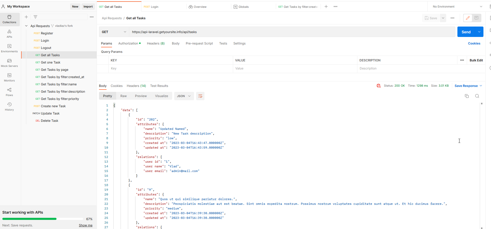

## Api на Laravel 9 с использованием Laravel Sanctum

```bash
https://laravel.com/docs/9.x/sanctum
```

Доступ к ресурсам Api предоставляется на основе токена от Sanctum для каждого пользователя.

Есть две таблицы - 'users' (20 records) и 'tasks' (200 records).

### Существующие роуты:

Register:
```bash
https://api-laravel.getyoursite.info/api/register
```

Login:
```bash
https://api-laravel.getyoursite.info/api/login
```

Logout:
```bash
https://api-laravel.getyoursite.info/api/logout
```

Create new Task:
```bash
https://api-laravel.getyoursite.info/api/tasks
```

Update Task:
```bash
https://api-laravel.getyoursite.info/api/tasks/202
```

Delete Task:
```bash
https://api-laravel.getyoursite.info/api/tasks/202
```

### Фильтрация данных по различным параметрам:

Get all Tasks:
```bash
https://api-laravel.getyoursite.info/api/tasks
```

Get one Tasks:
```bash
https://api-laravel.getyoursite.info/api/tasks/9
```

Get Tasks by page number:
```bash
https://api-laravel.getyoursite.info/api/tasks?page=2
```

Get Tasks by filter:created_at:
```bash
https://api-laravel.getyoursite.info/api/tasks?filter=created_at:2023-03-04
```

Get Tasks by filter:name:
```bash
https://api-laravel.getyoursite.info/api/tasks?filter=name:or
```

Get Tasks by filter:description:
```bash
https://api-laravel.getyoursite.info/api/tasks?filter=description:dolor
```

Get Tasks by filter:priority:
```bash
https://api-laravel.getyoursite.info/api/tasks?filter=priority:low
```

### Тестирование возможно двумя спопсобами

## 1. Postman

Для тестирования можно использовать Postman. Нужно зарегистрироваться или войти
в свой аккаунт Postman.

```bash
https://www.postman.com/
```

Установлено ограничение доступа к данным для пользователей. Пользователь может работать только со своими задачами.

Далее перейдите по адресу:

```bash
https://www.postman.com/speeding-firefly-941566/workspace/api-laravel/collection/25973223-c446ea1f-d706-457f-963b-f43a95636c8a?ctx=documentation
```

Выберите любой запрос из списка 'Api Requests'.
Наведите курсор на кнопку 'Send' и нажмите на появившуюся кнопку 'Create a Fork'
и далее нажмите на кнопку 'Forк Collection'.

По умлочанию есть действующая регистрация пользователя.

Теперь нужно залогиниться.

Из списка 'Api Requests' выберите запрос 'Login' и нажмите на кнопку 'Send'.
Скопируйте Token:


Кликните 'My Workspace' и потом 'Environments':


Кликните 'Globals':


Вставьте Token в поля таблицы и заполните другие поля как показано на срине и
ОБЯЗЯТЕЛЬНО нажмите 'Save':


Теперь вы можете протестровать все запросы к Api.

Пример:



## 2. Тестирование с помощью интерфейса на другом домене

Перейдите по адресу:

```bash
https://get-api-resources.getyoursite.info/
```

Все данные поступают с https://api-laravel.getyoursite.info/

Нужно залогиниться.

Email:

```bash
admin@mail.com
```

Password:

```bash
123456789
```


Можно просмотреть все задачи или выполнить поиск по выбранным параметрам - name,
description, priority, created_at, updated_at.

Нужно выбрать один из параметров из меню 'Select data for searching' и в поле 'Search' напечатать не менее двух символов.

```bash
https://github.com/VladULazarev/get-api-resources
```